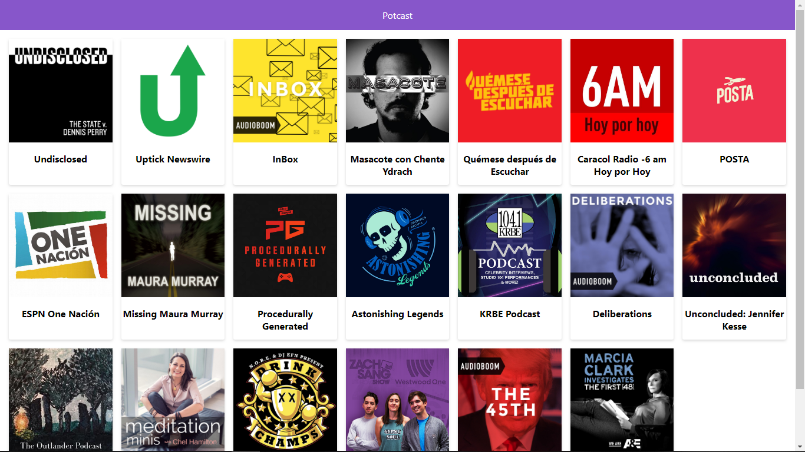

#App de Podcast de Platzi

Apps de Podcats integrada con la API de AUDIOBOOM para aprender Next.JS

## ¿Como funciona?

Requiere Node.JS 10

* `npm install` para instalar las dependencias
* `npm run dev` para el entorno de desarrollo
* `npm run build && nom start` para el entorno de produccion

## Licencia

MIT

